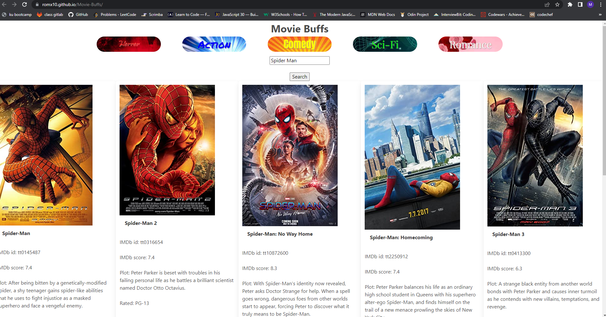

# Movie-Buffs
A library for users to  genre input movies or genres, and they are then presented with the top movies from Rotten Tomatoes.

# Usage

This web app is an application to search for movies that you want to get more info about that movie. or see top ten movies based on a genre. This application uses Jquery and Bulma for some functionality. Bulma is version 0.9.4 and jquery is using mobile version 1.4.5 along with ajax jquer version 2.1.3 for some styling and Javascript functionality. Along with this basic HTML and Javascript there was a couple of API's used as well which were OMDb and the NY times.

# ScreenShot

# Links

the deployed application:  https://romx10.github.io/Movie-Buffs/

Link to the APIs: http://www.omdbapi.com/
                 https://developer.nytimes.com/docs/movie-reviews-api/1/routes/reviews/search.json/get

# Credits

Mitchell Easterling: GitHub: https://github.com/measterling13

Zane Nichols: GitHub: https://github.com/NicholsZane13

Roman Stigler: GitHub: https://github.com/romX10

Justo Menchaca: GitHub: https://github.com/JustoM01

# Additional Support

Ian Von Fange: GitHub: https://github.com/eliaswolfgang

Joshua Diehl: GitHub: https://github.com/JaynewDee
